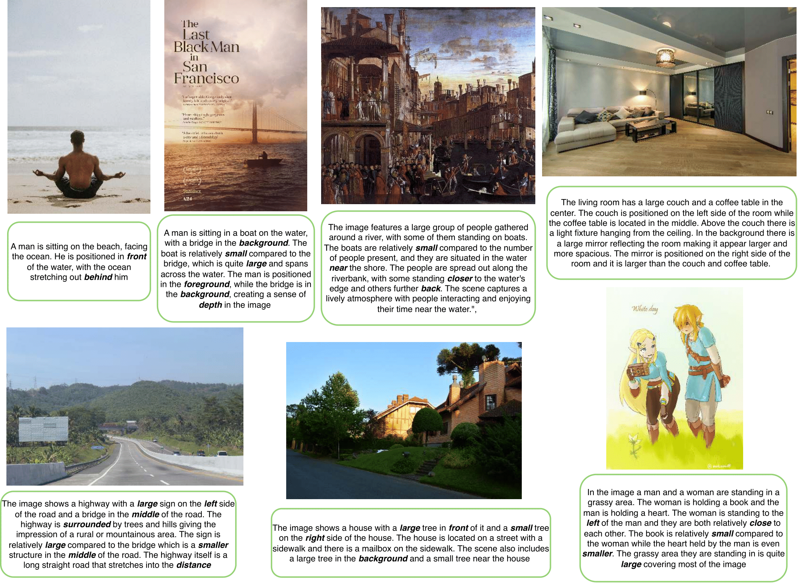

# SPRIGHT 🖼️✨

Welcome to the official GitHub repository for our paper titled "Getting it Right: Improving Spatial Consistency in Text-to-Image Models". Our work introduces a simple approach to enhance spatial consistency in text-to-image diffusion models, alongside a high-quality dataset designed for this purpose.

**_Getting it Right: Improving Spatial Consistency in Text-to-Image Models_** by Agneet Chatterjee<sup>$</sup>, Gabriela Ben Melech Stan<sup>$</sup>, Estelle Aflalo, Sayak Paul, Dhruba Ghosh, Tejas Gokhale, Ludwig Schmidt, Hannaneh Hajishirzi, Vasudev Lal, Chitta Baral, Yezhou Yang.

<sup>$</sup> denotes equal contribution.

<p align="center">
    🤗 <a href="https://huggingface.co/SPRIGHT-T2I" target="_blank">Models & Datasets</a> | 📃 <a href="" target="_blank">Paper</a> |
    ⚙️ <a href="https://huggingface.co/spaces/SPRIGHT-T2I/SPRIGHT-T2I" target="_blank">Demo</a> |
    🎮 <a href="https://spright.github.io/" target="_blank">Project Website</a>
</p>

## 📄 Abstract
TODO

## 📚 Contents
- [Installation](#💾-installation)
- [Training](#🔍-training)
- [Inference](#🌺-inference)
- [The SPRIGHT Dataset](#🖼️-the-spright-dataset)
- [Eval](#📊-evaluation)
- [Citing](#📜-citing)
- [Acknowledgments](#🙏-acknowledgments)

## 💾 Installation

Make sure you have CUDA and PyTorch set up. The PyTorch [official documentation](https://pytorch.org/) is the best place to refer to for that. Rest of the installation instructions are provided in the respective sections. 

If you have access to the Habana Gaudi accelerators, you can benefit from them as our training script supports them.

## 🔍 Training

Refer to [`training/`](./training).

## 🌺 Inference

```python
from diffusers import DiffusionPipeline
import torch 

spright_id = "SPRIGHT-T2I/spright-t2i-sd2"
pipe = DiffusionPipeline.from_pretrained(spright_id, torch_dtype=torch.float16).to("cuda")

image = pipe("A horse above a pizza").images[0]
image
```

You can also run [the demo](https://huggingface.co/spaces/SPRIGHT-T2I/SPRIGHT-T2I) locally:

```bash
git clone https://huggingface.co/spaces/SPRIGHT-T2I/SPRIGHT-T2I
cd SPRIGHT-T2I
python app.py
```

Make sure `gradio` and other dependencies are installed in your environment.

## 🖼️ The SPRIGHT Dataset

Refer to [our paper] and [the dataset page](https://huggingface.co/datasets/SPRIGHT-T2I/spright) for more details. Below are some examples from the SPRIGHT dataset:

<p align="center">

</p>

## 📊 Evaluation

In the [`eval/`](./eval) directory, we provide details about the various evaluation methods we use in our work .

## 📜 Citing

```bibtex
@article{yourname2024getting,
  title={Getting it Right: Improving Spatial Consistency in Text-to-Image Models},
  author={Your Name and Co-authors},
  journal={Journal Name},
  year={2024},
  publisher={Publisher}
}
```

## 🙏 Acknowledgments

TODO
